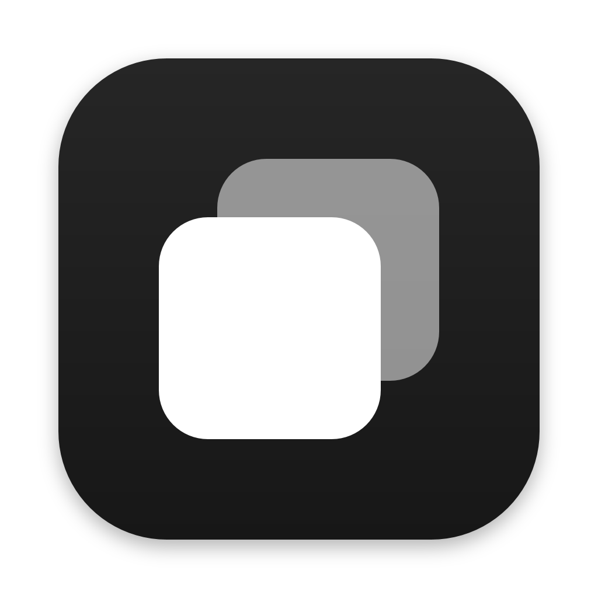
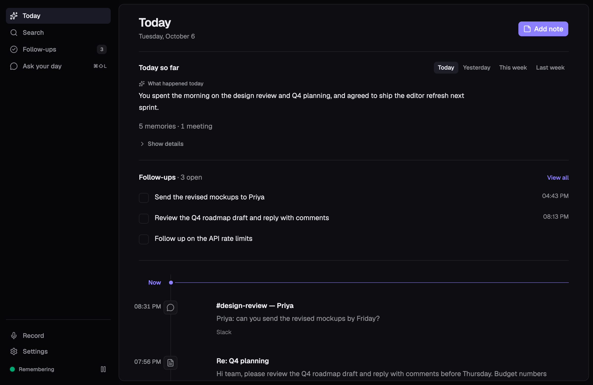
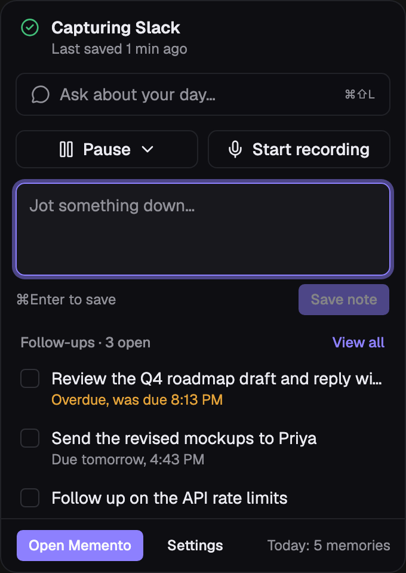

<p align="center">
  
</p>

<h1 align="center">Memento</h1>

A **private, local-first memory layer for your workday** — a native macOS app
modeled on tools like Minimi/Shram, but with **no cloud database and no data
leaving your Mac**. It watches what you work on, turns it into searchable
memory, and helps you keep track of the things you promised to do.

<p align="center">
  
</p>

<p align="center"><sub>The Today screen.</sub></p>

<p align="center">
  
</p>

<p align="center"><sub>The menu-bar popover: ask a question, pause, record, jot a note, or tick off a follow-up without opening the app.<br>Screenshots use sample data.</sub></p>

## What it does

- **Runs from the menu bar.** Captures quietly in the background; the main
  window opens on demand. Closing the window hides the app — it keeps running.
- **Captures only meaningful work, via adapters.** A dedicated allowlist of
  adapters covers the common work surfaces — Mail, Outlook, Spark, Slack,
  Teams, Discord, WhatsApp (native + web), Gmail, LinkedIn. Random native
  apps, generic browsing, password managers, and macOS system UI (System
  Settings, Finder, …) are never recorded. Near-duplicate screens (clocks,
  scroll, cursors) are suppressed so memory stays readable.
- **Eras of state per thread.** Captures group into threads, and every thread
  keeps an append-only hourly snapshot history (`memory_versions`): content,
  word count, parent version, frozen once the hour rolls over — so you can
  reconstruct "what was on screen at 3pm".
- **Finds action items** locally — commitments, follow-ups, and deadlines are
  extracted with heuristics (no LLM needed), tagged urgent/unread, and given a
  scheduled `remind_at` ("Send it by Friday" → Friday 9am).
- **Reminder nudge, batched.** A 60s worker batches all due reminders into ONE
  notification (missed-reminder catch-up included) and honors macOS Do Not
  Disturb / Focus before surfacing it.
- **Your memory is a Markdown vault.** Every memory is mirrored as plain
  `.md` into an Obsidian-compatible vault (activity, meetings, daily
  `[[wiki-link]]` indexes, and a `notes/` folder that is ingested back).
  Search is keyword-first (SQLite FTS5) — no opaque embeddings; you can open,
  edit, and own every memory file.
- **Meeting & voice-note pipeline.** mic (+ optional system audio) recording →
  native Whisper transcription (whisper.cpp via `transcribe-rs`, Whisper Tiny
  GGML) → titled meeting memory (deduplicated titles) or a lighter voice note.
  Transcription runs on the Rust side, so it keeps working when the window is
  closed. "micwatch" can auto-start when a meeting app comes forward and
  auto-stop when it ends, with a max-duration clamp so recordings never run
  forever.
- **Ask your day, over anything.** Open it with ⌘⇧L from any app, from
  **Ask your day** in the sidebar, or from the menu-bar popover. A floating,
  always-on-top panel answers from the current screen (frontmost app, window
  title, selected text), your captured memory, and open follow-ups. Questions
  can name a time ("what did I promise last Tuesday?"). With a local LLM it
  writes an answer; **without one it still works** and shows the matching
  memories and follow-ups it found. Everything stays on-device.
- **Timed pause & hourly check-in.** The tray can pause capture for 5/10/30/60
  minutes with auto-resume, and a quiet hourly notification summarizes the
  past hour (memories, follow-ups) honoring Do Not Disturb.
- **Local MCP server.** A built-in SSE server on `127.0.0.1` exposes the same
  memory/meeting/agent tools to external LLMs over the Model Context Protocol,
  fully on-device (`mcpStdio.cjs` bridges Claude Desktop to it).
- **Stores everything locally** on your Mac: SQLite (memories, versions, app
  visits, conversations, action items, agent runs) mirrored into the Markdown
  memory vault.

## Stack

- **Shell** — Tauri 2 (Rust backend in `src-tauri/`)
- **Frontend** — React + TypeScript + Vite in `src/`
- **UI** — shadcn/ui (nova preset, Base UI primitives)
- **Storage** — SQLite (rusqlite, bundled) + FTS5 in `src-tauri/src/db.rs`;
  Obsidian-compatible Markdown vault (`src-tauri/src/vault.rs`)
- **Local AI** — native **Whisper Tiny** transcription (whisper.cpp bindings
  via [`transcribe-rs`](https://crates.io/crates/transcribe-rs),
  Metal-accelerated). No embedding models — the Markdown vault is the memory.
- **OS integration** — Accessibility (AX) capture, menu-bar tray, audio capture

## Run it

```sh
npm install
npm run tauri dev      # development (hot reload)
npm run tauri build    # release .app
```

On first launch, grant the permissions the app asks for in **System Settings >
Privacy & Security**: **Accessibility** (required for capture), **Microphone**
(required for meeting recording). The Settings pane in the app opens each
permission pane and shows live status.

## The views

- **Timeline** — search and filter your captured memory; read and delete
  entries.
- **Threads** — work sessions grouped by app, with **eras of state**: a frozen-
  per-hour version history per thread (word counts, live/frozen badges).
- **Meetings** — start/stop a recording (meeting or **voice note**); it
  transcribes locally and turns the transcript into a titled meeting memory +
  action items, or a lighter voice note. micwatch can auto-start/auto-stop.
- **Actions** — commitments extracted from memory and meetings: urgent/unread
  badges, scheduled reminders, batch nudge banner, local summary agent,
  resolve/dismiss/+1h.
- **Settings** — permission status, capture pause, micwatch controls, reminder
  nudges, audio/transcription model choices, MCP server, and your database path.

## Local MCP server ("LLM brain")

Settings → **LLM brain — local MCP** starts an on-device server exposing the
memory/meeting/agent tools over **SSE on 127.0.0.1** (Model Context Protocol).
Claude Desktop connects through the bundled `mcpStdio.cjs` bridge — press
**Add to Claude Desktop** (config is written; restart Claude to pick it up).
All tool calls run against the local database; nothing is relayed.

## Command surface

All Tauri commands live in `src-tauri/src/lib.rs`; the typed JS client is
`src/lib/api.ts`. Server events (`memory-new`, `recording-stopped`,
`recording-started`, `recording-auto-stopped`, `reminders-due`,
`versions-updated`, `pause-changed`, `new-memory`, `visit`) keep the UI in
sync with capture, meeting recording, and nudges.

## Layout

- `src-tauri/src/lib.rs` — Tauri setup, tray, event wiring, ~45 commands
- `src-tauri/src/db.rs` — SQLite schema + CRUD + FTS5 keyword search +
  memory versions + reminder queue
- `src-tauri/src/monitor.rs` — background Accessibility watcher (app visits +
  visible-text capture)
- `src-tauri/src/ax.rs` — Accessibility (AX) helpers via objc2
- `src-tauri/src/audio.rs` — microphone + system-audio recording (cpal /
  ScreenCaptureKit)
- `src-tauri/src/transcribe.rs` — native transcription: GGML model download &
  cache, WAV decode/resample/mixdown, whisper.cpp inference, transcript events
- `src-tauri/src/adapters.rs` — per-app capture allowlist: one parser per
  supported app/web service, privacy gates, generic activity returns nothing
- `src-tauri/src/actions.rs` — local action-item heuristics (urgency/scheduling)
- `src-tauri/src/versions.rs` — hourly thread snapshot + freeze worker
- `src-tauri/src/reminders.rs` — due-reminder batching, DND hook, nudge worker
- `src-tauri/src/micwatch.rs` — auto start/stop + max-duration clamp
- `src-tauri/src/mcp_http.rs` — local SSE MCP server; `local_tools.rs` — tool surface
- `src-tauri/src/vault.rs` — Obsidian-compatible Markdown memory vault
  (export + `notes/` ingest, 60s sync worker)
- `src-tauri/src/tray.rs` — menu-bar tray
- `mcpStdio.cjs` — Claude Desktop ⇄ local MCP bridge
- `src/lib/store.tsx` — frontend state + event-driven transcription status
- `src/components/*` — the shadcn views
## Notes & limitations

- **Models**: the Whisper Tiny GGML model (`ggml-tiny.en.bin` /
  `ggml-tiny.bin`) is fetched from the Hugging Face CDN on first use into
  `~/Library/Application Support/dev.poppy.memento/models/`. All
  **computation is local** — no memory content is ever sent to a server.
- **System audio** (other participants) is not yet wired up — the extension
  point exists (`audio::spawn_system`) but requires the Swift-based
  ScreenCaptureKit bridge, which is not bundled yet. Microphone capture works.
- The bundle identifier is `dev.poppy.memento`; local data lives in
  `~/Library/Application Support/dev.poppy.memento/memento.db`.
- The original Native SDK demo (`core.ts`, `app.native`) is archived in
  `legacy/`.

## License

[MIT](LICENSE) © 2026 Criston Mascarenhas.
